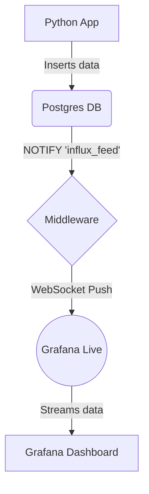

# Architectural Plan: Real-Time Streaming with Grafana Live

This document outlines the architectural changes required to convert the existing data pipeline to a true real-time streaming solution using Grafana Live.

## 1. Proposed Architecture

The new architecture will simplify the data flow by removing the intermediate databases for the real-time path. The Python `middleware` will push data directly to Grafana via a WebSocket, and Grafana will stream it to the dashboard.

### Mermaid Diagram:



## 2. Grafana Live Configuration

To enable Grafana Live, we need to create a custom `grafana.ini` file and mount it into the Grafana container.

**File to be created:** `grafana/grafana.ini`

```ini
[live]
# Enable Grafana Live
enabled = true

# Set the maximum number of connections (adjust as needed)
max_connections = 100

# Allow anonymous access to live streams if needed
allow_anonymous = true
```

**`docker-compose.yml` Modification:**

The `grafana` service definition in `docker-compose.yml` must be updated to mount this new configuration file.

```yaml
services:
  grafana:
    image: grafana/grafana:latest
    ports:
      - "3000:3000"
    environment:
      GF_SECURITY_ADMIN_USER: admin
      GF_SECURITY_ADMIN_PASSWORD: password
    volumes:
      - ./grafana/provisioning:/etc/grafana/provisioning
      - ./grafana/grafana.ini:/etc/grafana/grafana.ini  # <-- Add this line
```

## 3. Middleware Modification (`middleware/main.py`)

The middleware will be refactored to push data directly to a Grafana Live stream instead of writing to InfluxDB.

**Library Updates (`middleware/requirements.txt`):**

The following libraries will be required. `websockets` will be used for the WebSocket connection.

```
psycopg2-binary
websockets
```

**Conceptual Code Structure (`middleware/main.py`):**

The `main.py` script will be updated to use `websockets` to connect to the Grafana Live push endpoint.

```python
import os
import asyncio
import json
import select
import psycopg2
from psycopg2 import OperationalError
import websockets

# ... (create_postgres_connection function remains the same) ...

async def push_to_grafana(data):
    """Pushes data to the Grafana Live stream."""
    stream_id = 'my_stream_id'
    grafana_url = f"ws://grafana:3000/api/live/push/{stream_id}"
    
    # This requires a Grafana API key with Admin or Editor role
    # For simplicity in this example, we assume Grafana's anonymous access is enabled.
    # In a production setup, you should use an API key.
    # headers = {'Authorization': f'Bearer {os.environ.get("GRAFANA_API_KEY")}'}
    
    try:
        async with websockets.connect(grafana_url) as websocket:
            # The payload should be a JSON object with a 'fields' array
            # containing key-value pairs for the data.
            grafana_payload = {
                "fields": [
                    {"name": "time", "values": [data["timestamp"]]},
                    {"name": "value", "values": [float(data["value"])]}
                ]
            }
            await websocket.send(json.dumps(grafana_payload))
            print(f"Pushed to Grafana Live: {data['value']}")
    except Exception as e:
        print(f"Failed to push to Grafana Live: {e}")

def main():
    """Main function to listen for notifications and push to Grafana Live."""
    conn = create_postgres_connection()
    print("Successfully connected to PostgreSQL!")

    try:
        with conn.cursor() as cur:
            cur.execute("LISTEN influx_feed;")
            print("Listening on channel 'influx_feed'...")

            while True:
                if select.select([conn], [], [], 5) == ([], [], []):
                    print("No new notifications...")
                else:
                    conn.poll()
                    while conn.notifies:
                        notify = conn.notifies.pop(0)
                        print(f"Received notification: {notify.payload}")
                        
                        payload_data = json.loads(notify.payload)
                        
                        # Run the async push function
                        asyncio.run(push_to_grafana(payload_data))

    except (Exception, psycopg2.DatabaseError) as error:
        print(error)
    finally:
        if conn is not None:
            conn.close()
            print("PostgreSQL connection closed.")

if __name__ == "__main__":
    main()
```

## 4. Dashboard Reconfiguration (`dashboard.json`)

The dashboard panel needs to be updated to use the "Grafana" data source, which is the entry point for Grafana Live streams.

**`grafana/provisioning/dashboards/dashboard.json` Modification:**

The panel that currently uses InfluxDB will be changed to subscribe to the live stream.

```json
{
  "title": "Live Metric (Grafana Live)",
  "type": "gauge",
  "datasource": {
    "type": "grafana",
    "uid": "-- Grafana --"
  },
  "targets": [
    {
      "refId": "A",
      "datasource": {
        "type": "grafana",
        "uid": "-- Grafana --"
      },
      "channel": "live/push/my_stream_id"
    }
  ],
  // ... rest of the panel configuration remains the same
}
```

## 5. Simplifying the Stack

With the real-time data now flowing directly to Grafana, InfluxDB is no longer needed for this part of the system.

**`docker-compose.yml` Simplification:**

-   Remove the `influxdb` service definition entirely.
-   Remove the `influxdb-data` volume.
-   Remove the `depends_on: - influxdb` from the `middleware` service.
-   Remove the InfluxDB environment variables from the `middleware` service.

**Postgres Trigger:**

The `postgres` trigger mechanism (`notify_new_record` function and the trigger on the `live_metrics` table) is still a valid way to initiate the push from the middleware. It decouples the data insertion from the real-time push. For this iteration, we will keep it. A future optimization could be to have the `python` service call the `middleware` service directly via an API endpoint, but the current trigger-based approach is robust.

## 6. Step-by-Step Implementation Guide

Here is the ordered list of steps for the `code` mode to implement the new architecture:

1.  **Create `grafana/grafana.ini`:** Create the new Grafana configuration file with the `[live]` section enabled.
2.  **Update `docker-compose.yml`:**
    *   Mount the new `grafana.ini` file into the `grafana` service.
    *   Remove the `influxdb` service.
    *   Remove the `influxdb-data` volume.
    *   Remove the InfluxDB-related environment variables and dependencies from the `middleware` service.
3.  **Update `middleware/requirements.txt`:** Replace `influxdb-client` with `websockets`.
4.  **Refactor `middleware/main.py`:**
    *   Remove all `influxdb_client` related code.
    *   Implement the `asyncio` and `websockets` logic to push data to the Grafana Live stream endpoint (`ws://grafana:3000/api/live/push/my_stream_id`).
5.  **Update `grafana/provisioning/dashboards/dashboard.json`:**
    *   Modify the "Live Metric (InfluxDB)" panel.
    *   Change the `datasource` to `grafana`.
    *   Update the `targets` to subscribe to the channel `live/push/my_stream_id`.