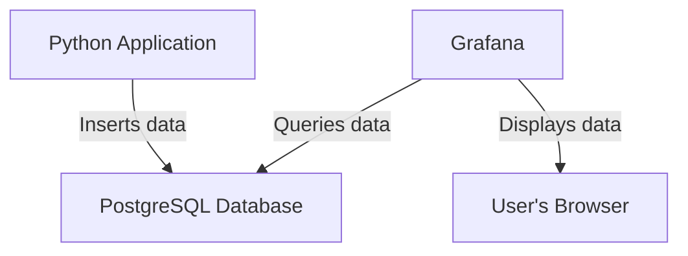

# Architectural Design: Real-time PostgreSQL Data in Grafana

This document outlines the architecture and plan for displaying real-time data from a PostgreSQL database in a Grafana dashboard.

## 1. Overall Architecture

The architecture consists of three main components: a Python application for data generation, a PostgreSQL database for data storage, and a Grafana instance for data visualization. These components are orchestrated using Docker Compose.

Here is a diagram illustrating the data flow:



## 2. Database Setup

The PostgreSQL database is defined as a service in the [`docker-compose.yml`](docker-compose.yml:4) file.

- **Service Name:** `postgres`
- **Image:** `postgres:latest`
- **Configuration:**
    - The database is initialized with a user, password, and database name defined by environment variables.
    - A volume `postgres-data` is used to persist the database data across container restarts.
    - Port `5432` is exposed to allow the Python application and Grafana to connect to it.

The [`python/main.py`](python/main.py:31) script automatically creates a `metrics` table with the following schema:

| Column    | Type        | Description                               |
|-----------|-------------|-------------------------------------------|
| `id`      | SERIAL      | Primary Key                               |
| `timestamp` | TIMESTAMPTZ | The time the metric was recorded (defaults to `NOW()`) |
| `value`   | FLOAT       | The randomly generated metric value       |

## 3. Data Ingestion

The Python application, located in the `python/` directory, is responsible for generating and inserting data into the PostgreSQL database.

- **Connection:** The script in [`python/main.py`](python/main.py:7) connects to the PostgreSQL database using the credentials provided via environment variables in the `docker-compose.yml` file. It includes a retry mechanism to handle cases where the database is not yet ready.
- **Data Generation:** The script generates a random float value every 5 seconds.
- **Data Insertion:** Each new value is inserted into the `metrics` table.

## 4. Grafana Configuration

Grafana is also defined as a service in the [`docker-compose.yml`](docker-compose.yml:26) file. The configuration is handled through provisioning, which allows for defining data sources and dashboards via configuration files.

### Data Source

The PostgreSQL data source is defined in [`grafana/provisioning/datasources/datasource.yml`](grafana/provisioning/datasources/datasource.yml:1). This file tells Grafana how to connect to the PostgreSQL database.

- **Name:** `PostgreSQL`
- **Type:** `postgres`
- **URL:** `postgres:5432` (connects to the `postgres` service)
- **Database:** `testdb`
- **User:** `user`

### Dashboard

The dashboard is defined in [`grafana/provisioning/dashboards/dashboard.json`](grafana/provisioning/dashboards/dashboard.json:1).

- **Title:** "Python Metrics Dashboard"
- **Panel:** A single time-series panel is configured.
- **Query:** The panel queries the `metrics` table to get the `timestamp` and `value` columns.
  ```sql
  SELECT
    "timestamp" AS "time",
    "value"
  FROM
    metrics
  ORDER BY
    "timestamp" ASC
  ```

### Real-time Updates

To make the dashboard display data in "real-time", you can set an auto-refresh interval in the Grafana UI.

1.  Open the dashboard in Grafana (available at `http://localhost:3000`).
2.  In the top right corner, click on the "Refresh" button (it might say "Off" or show a time interval).
3.  Select a refresh interval, for example, "5s".

This will cause Grafana to re-query the PostgreSQL database every 5 seconds and update the dashboard with the latest data.